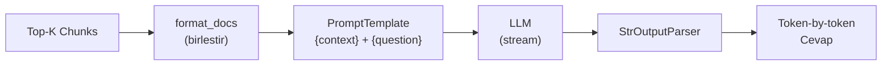

# Generation Pipeline

Bulunan chunk'lardan cevap ureten katman. LangChain LCEL (LangChain Expression Language) ile chain olarak calisir.

## Akis



## LCEL Chain

```python
chain = (
    {
        "question": RunnablePassthrough(),
        "context": retriever | RunnableLambda(format_docs)
    }
    | prompt
    | llm
    | StrOutputParser()
)
```

**Ne yapar:**

1. `RunnablePassthrough()` — soruyu olduqu gibi `{question}` alanina gecirir
2. `retriever` — soruyla arama yapar, `List[Document]` dondurur
3. `format_docs` — chunk'lari `\n\n` ile birlestirip tek string yapar
4. `prompt` — `{context}` ve `{question}` alanlarini doldurur
5. `llm` — cevap uretir (streaming)
6. `StrOutputParser` — LLM ciktisini string'e parse eder

## Prompt Template

`src/prompting.py` → `build_prompt()` merkezi prompt sablonu dondurur.

### Temel Kurallar

| Kural | Aciklama |
|-------|----------|
| **Baglaama dayali** | Sadece verilen context'ten cevap ver |
| **Hallucination guard** | Cevap yoksa "Baglamda cevap bulunamadi." |
| **Turkce (ASCII)** | Normal cumleler Turkce, ozel karakter yok |
| **Teknik terimler** | STT, API, HTTP vb. olduqu gibi korunur |
| **Kisa + bullet** | 1-2 cumle direkt cevap + gerekirse maddeler |
| **Tekrar yok** | Ayni fikri birden fazla kez soyleme |

### Few-shot Ornekler

Prompt icinde 4 ornek var:

1. Basit soru (tek cevap)
2. Cok parcali soru (her parcaya ayri cevap)
3. Cevap bulunamayan soru (fallback)
4. Teknik terim iceren soru (abbreviation policy)

## LLM Backendleri

### OpenAI (`LLM_BACKEND=openai`)

| Parametre | Deger |
|-----------|-------|
| Model | `gpt-4o-mini` |
| Temperature | 0.3 |
| Max tokens | 512 |
| Wrapper | `ChatOpenAI` (langchain-openai) |

### vLLM (`LLM_BACKEND=vllm`)

| Parametre | Deger |
|-----------|-------|
| Model | `hugging-quants/Meta-Llama-3.1-8B-Instruct-AWQ-INT4` |
| Quantization | AWQ INT4 |
| max_model_len | 4096 |
| gpu_memory_utilization | 0.85 |
| Temperature | 0.3 |
| frequency_penalty | 0.8 |
| Wrapper | `VLLM` (langchain-community) |

### Trendyol (`LLM_BACKEND=trendyol`)

| Parametre | Deger |
|-----------|-------|
| Model | `Trendyol/Trendyol-LLM-8B-T1` |
| Base | Qwen3-8B (Turkce fine-tuned) |
| max_model_len | 8192 |
| gpu_memory_utilization | 0.83 |
| dtype | float16 |
| Ozel mod | `/think` (reasoning) / `/no_think` (concise) |

## Streaming

`chain.stream(query)` ile token-by-token cevap dondurur. CLI'da `print(chunk, end="", flush=True)`, Streamlit'te `message_placeholder.markdown(full_response + "▌")` ile gosterilir.
