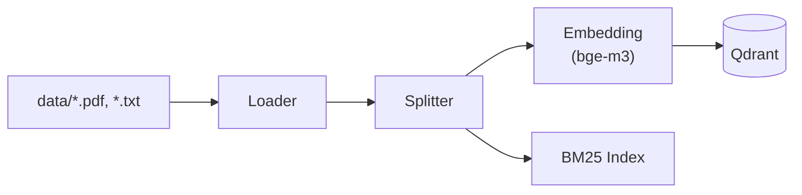

# Ingestion Pipeline

Dokumanlari diskten okuyup vektor veritabanina indexleyen katman. Uygulama basinda 1 kez calisir; Streamlit'te upload ile incremental olarak genisler.

## Akis



## 1. Loader

`src/loader.py` — PDF ve TXT dosyalarini LangChain `Document` objelerine cevirir.

| Dosya tipi | Loader | Davranis |
|-----------|--------|----------|
| `.pdf` | `PyPDFLoader` | Sayfa sayfa parse eder |
| `.txt` | `TextLoader` | Duz metin, UTF-8 |

**Iki fonksiyon:**

- `load_documents(data_dir)` — klasordeki tum dosyalari yukler (baslangic)
- `load_single_document(file_path)` — tek dosya yukler (Streamlit upload)

## 2. Splitter

`src/splitter.py` — Uzun dokumanlari kucuk chunk'lara boler.

### Recursive (varsayilan)

```python
RecursiveCharacterTextSplitter(chunk_size=600, chunk_overlap=100)
```

- Karakter sayisina gore boler
- `\n\n` → `\n` → ` ` → `""` hiyerarsi ile anlamli sinirlar arar
- Hizli ve deterministik
- **Trade-off:** Cumle ortasindan kesebilir

### Semantic (opsiyonel)

```python
SemanticChunker(embeddings=bge_m3, breakpoint_threshold_amount=0.95)
```

- Ardisik cumleler arasindaki embedding benzerligini olcer
- Benzerlik %95'in altina dustugu yerde boler
- Anlam butunlugu koruyan chunk'lar uretir
- **Trade-off:** Her cumle icin embedding hesaplar → yavas

!!! info "Chunk boyutu neden 600?"
    RAG'da chunk ne kadar kucukse retrieval o kadar hassas olur. Ama cok kucuk chunk'lar baglam kaybina neden olur. 600 karakter, ders notlari gibi yapilandirilmis icerik icin iyi bir denge noktasidir.

## 3. Embedding

`src/vectorstore.py` → `create_embeddings()`

| Parametre | Deger |
|-----------|-------|
| Model | `BAAI/bge-m3` |
| Vektor boyutu | 1024 |
| Normalizasyon | `normalize_embeddings=True` |
| Cihaz | `cuda` veya `cpu` |

**Neden bge-m3:** Multilingual SOTA. Tek model ile Turkce + Ingilizce icerigi ayni vektor uzayinda temsil eder. Normalize edilmis vektorler sayesinde cosine similarity = dot product, bu da Qdrant'ta hizli arama saglar.

## 4. Qdrant (Vector Store)

`src/vectorstore.py` → `create_vectorstore()`

| Parametre | Deger |
|-----------|-------|
| Engine | Qdrant (Docker) |
| Baglanti | HTTP (`http://localhost:6333`) |
| Collection | `rag_collection` |
| Index | HNSW (varsayilan) |
| Distance | Cosine |

**Idempotent mantik:**

1. Collection varsa → mevcut veriyi yukle
2. Collection yoksa + docs varsa → yeni olustur
3. Collection yoksa + docs yoksa → bos store dondur

**Incremental Indexing:**

- `add_documents_to_collection()` — chunk'lari mevcut collection'a ekler
- `delete_from_collection()` — `metadata.source == file_path` filtresi ile siler

## 5. BM25 Index

`src/retriever.py` → `build_bm25_retriever(docs)`

- `rank-bm25` paketi ile inverted index kurar
- In-memory (RAM'de yasar)
- Uygulama basinda 1 kez build edilir
- Streamlit'te upload/delete ile yeniden build edilir
