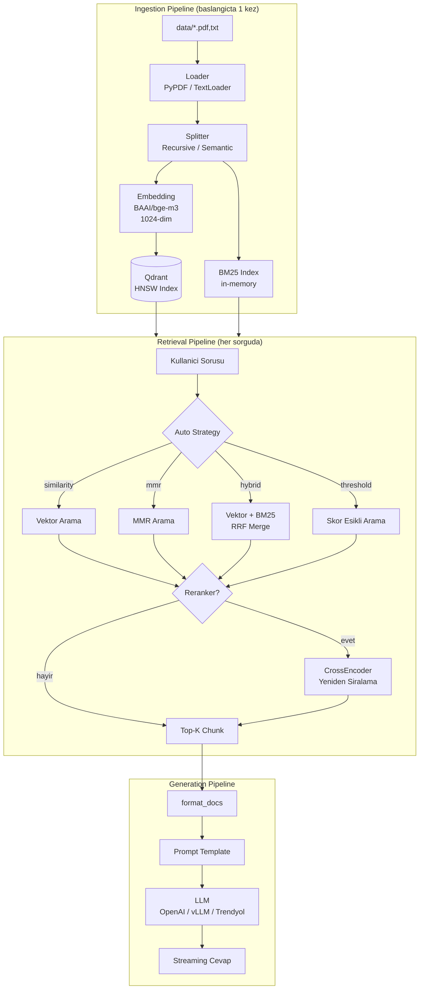

# Genel Bakis

RAG Pipeline uc ana katmandan olusur: **Ingestion** (veri hazirlama), **Retrieval** (arama) ve **Generation** (cevap uretme).

## Mimari Diagram

## Katman Ozeti

| Katman | Gorev | Ne Zaman Calisir |
|--------|-------|-------------------|
| **Ingestion** | Dokumanlari yukle, bol, vektorlestir, indexle | Uygulama basinda 1 kez + upload |
| **Retrieval** | Soruya en uygun chunk'lari bul | Her sorguda |
| **Generation** | Bulunan chunk'larla cevap uret | Her sorguda |

## Teknoloji Haritasi

| Katman | Teknoloji | Rol |
|--------|-----------|-----|
| Embedding | BAAI/bge-m3 (HuggingFace) | Metin → 1024-dim vektor |
| Vector DB | Qdrant (Docker, HNSW) | Vektor depolama + benzerlik arama |
| BM25 | rank-bm25 | Kelime bazli arama (hybrid icin) |
| Reranker | BAAI/bge-reranker-base (CrossEncoder) | Sonuc yeniden siralama |
| LLM | OpenAI / vLLM / Trendyol | Cevap uretme |
| Framework | LangChain (LCEL) | Pipeline orkestrasyon |
| Tracing | LangSmith | Observability |
| Web UI | Streamlit | Kullanici arayuzu |

## VRAM Butcesi (12 GB GPU)

=== "vLLM (LLaMA 8B AWQ)"

    | Bilesen | VRAM |
    |---------|------|
    | LLM model (AWQ INT4) | ~4.5 GB |
    | KV Cache (4096 ctx) | ~0.4 GB |
    | Embedding (bge-m3) | ~1.5 GB |
    | CUDA overhead | ~1.0 GB |
    | Buffer | ~1.8 GB |
    | **Toplam** | **~9.2 GB / 12 GB** |

=== "Trendyol (8B FP16)"

    | Bilesen | VRAM |
    |---------|------|
    | LLM model (FP16) | ~8-9 GB |
    | KV Cache (8192 ctx) | ~2-3 GB |
    | Embedding (bge-m3) | ~1.5 GB |
    | CUDA overhead | ~1.0 GB |
    | **Toplam** | **~12.5+ GB / 12 GB** :warning: |

=== "OpenAI (Cloud)"

    | Bilesen | VRAM |
    |---------|------|
    | LLM model | 0 GB (cloud) |
    | Embedding (bge-m3) | ~1.5 GB |
    | CUDA overhead | ~1.0 GB |
    | **Toplam** | **~2.5 GB / 12 GB** |

Detaylar icin alt sayfalara bakin:

- [Ingestion Pipeline](ingestion.md)
- [Retrieval Pipeline](retrieval.md)
- [Generation Pipeline](generation.md)
