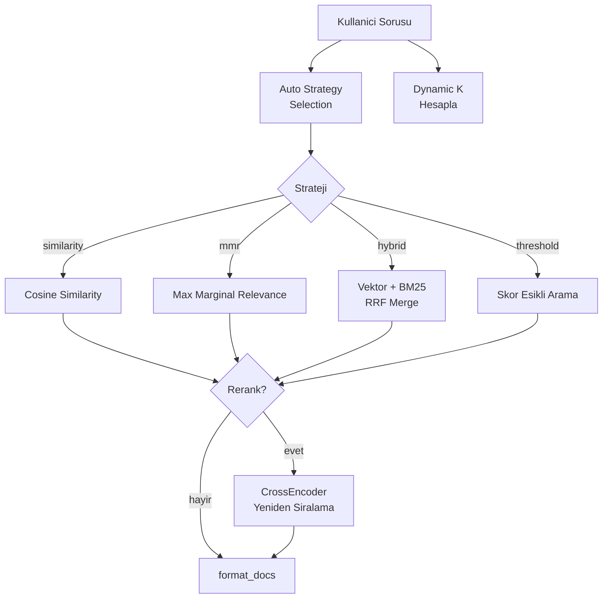

# Retrieval Pipeline

Kullanici sorusuna en uygun chunk'lari bulan katman. Her sorguda calisir. Projenin en karmasik ve en kritik bilesendir.

## Akis



## 1. Auto Strategy Selection

Sorunun icerigi analiz edilerek en uygun arama stratejisi otomatik secilir:

| Soru icerigi | Strateji | Neden |
|-------------|----------|-------|
| "kac", "sure", "dakika" | `hybrid` | Sayisal bilgi → kelime eslesmesi onemli |
| "neden", "nasil" | `mmr` | Aciklayici → farkli acilardan chunk gerekli |
| "kullanim alanlari", "nerelerde" | `threshold` | Genis kapsam → dusuk skorlu gurultuyu ele |
| Diger | `similarity` | En hizli, saf cosine similarity |

## 2. Dynamic K

Soru karmasikligina gore `k` (getirilecek chunk sayisi) dinamik hesaplanir:

| Karmasiklik | Indicator sayisi | k degeri |
|-------------|-----------------|----------|
| Basit | 0 | 6 (base) |
| Orta | 1 ("neden" veya "nasil") | 8 |
| Karmasik | 2+ ("nasil" + "neden" + ...) | 10 (max 12) |

**Neden:** Cok parcali sorular daha fazla baglam gerektirir. Az parcali sorgularda gereksiz context LLM'i yavaslatir.

## 3. Arama Stratejileri

### Similarity

En hizli. Qdrant'ta cosine similarity ile `k` chunk getirir.

### MMR (Max Marginal Relevance)

Hem relevance hem de diversity optimize eder. `lambda_mult=0.7` → %70 benzerlik, %30 cesitlilik.

`fetch_k=20` chunk cekilir, aralarindan MMR ile `k` tanesi secilir.

### Hybrid (Vektor + BM25)

Iki motor paralel calisir:

1. **Vektor arama** — anlamsal eslesme (Qdrant MMR)
2. **BM25 arama** — kelime frekansi eslesme (rank-bm25)

Sonuclar **RRF (Reciprocal Rank Fusion)** ile birlestirilir:

```
skor(doc) = vektor_weight * (1 / (60 + rank_vektor)) + bm25_weight * (1 / (60 + rank_bm25))
```

`bm25_weight=0.3` → %70 vektor, %30 BM25.

**Neden hybrid:** "Daily Scrum 15 dakika" iceriginde "15 dakika" kelimesini birebir eslestirmekte BM25, vektor aramasindan daha basarili. Ama "toplanti suresi" gibi semantik sorularda vektor arama gerekli. Ikisinin birlestirmesi en iyi sonucu verir.

### Threshold

`score_threshold=0.75` altindaki sonuclari eler. Genis kapsamli sorularda irrelevant chunk'larin prompt'a girmesini onler.

## 4. Multi-query (Opsiyonel)

LLM'e "bu soruyu N farkli sekilde ifade et" denir. Her varyasyon icin ayri arama yapilir, sonuclar deduplicate edilir.

```
Orijinal : "Sprint nedir?"
Alt-1    : "Sprint'in tanimi nedir?"
Alt-2    : "What is a Sprint in Scrum?"
Alt-3    : "Sprint kavrami ne anlama gelir?"
```

**Neden calisir:** Embedding modeli her ifade icin farkli vektorler uretir. Farkli vektorler farkli chunk'lari bulabilir. Bilingual icerik oldugunda ozellikle etkili.

**Trade-off:** N adet ek retrieval + 1 LLM call. Latency artar ama recall artar.

## 5. Reranking (Opsiyonel)

Base retriever'dan gelen sonuclar Cross-Encoder ile yeniden siralanir.

| Parametre | Deger |
|-----------|-------|
| Model (varsayilan) | `BAAI/bge-reranker-base` (~400 MB) |
| Model (hizli) | `cross-encoder/ms-marco-MiniLM-L-6-v2` (~80 MB) |
| Batch size | 8 |
| Cache | TTL 600s, max 100 entry |

**Akis:** 20 doc (rerank_top_n) cekilir → CrossEncoder ile skorlanir → Top 6 (k) secilir.

**Neden cross-encoder:** Retrieval'da bi-encoder (ayri embedding) kullanilir — hizli ama kaba eslesme. Cross-encoder ise (query, doc) ciftini birlikte isler — daha dogru skor ama yavas.

### Adaptive Skip

Basit sorgularda reranking atlanir (latency optimizasyonu):

- Tek kelime sorgu → skip
- < 4 kelime + karmasiklik gostergesi yok → skip
- `RERANK_FAST_MODE=true` → her zaman skip
