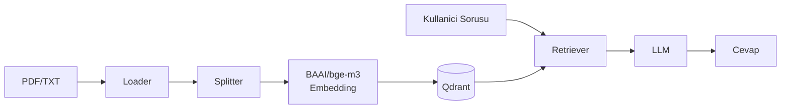

# RAG Pipeline

**Retrieval-Augmented Generation** — Turkce dokumanlarin uzerinde akilli soru-cevap sistemi.

---

## Ne Yapar?

PDF ve TXT dokumanlarinizi yukleyin, soru sorun, baglama dayali cevap alin. Harici bilgi kullanmaz, sadece sizin dokumanlarinizdan cevap uretir.

## Temel Yetenekler

| Yetenek | Aciklama |
|---------|----------|
| **Hybrid Search** | Vektor (anlamsal) + BM25 (kelime bazli) arama |
| **Auto Strategy** | Soru tipine gore otomatik arama stratejisi secimi |
| **Multi-query** | Soruyu birden fazla sekilde ifade ederek daha iyi sonuc |
| **Reranking** | Cross-encoder ile sonuclari yeniden siralama (%15-25 accuracy artisi) |
| **Incremental Indexing** | Dokuman ekle/sil, veritabani anlik guncellenir |
| **3 LLM Backend** | OpenAI (cloud), vLLM + LLaMA (local), Trendyol (Turkce local) |
| **Streaming** | Token token cevap (dusuk TTFT) |
| **LangSmith Tracing** | End-to-end observability |

## Arayuzler

=== "CLI"

    ```bash
    python main.py
    ```
    Interaktif terminal arayuzu. Gelistirme ve debug icin.

=== "Streamlit"

    ```bash
    streamlit run streamlit/app.py
    ```
    Web arayuzu. Dokuman yukleme/silme, arama ayarlari, chat.

=== "Benchmark"

    ```bash
    python benchmark.py --dataset data/benchmark.jsonl --runs 3
    ```
    Performans olcumu: latency, throughput, GPU stats.

## Teknoloji Yigini



## Hizli Baslangic

Kurulum ve ilk calistirma icin [Kurulum](getting-started/installation.md) sayfasina gidin.
