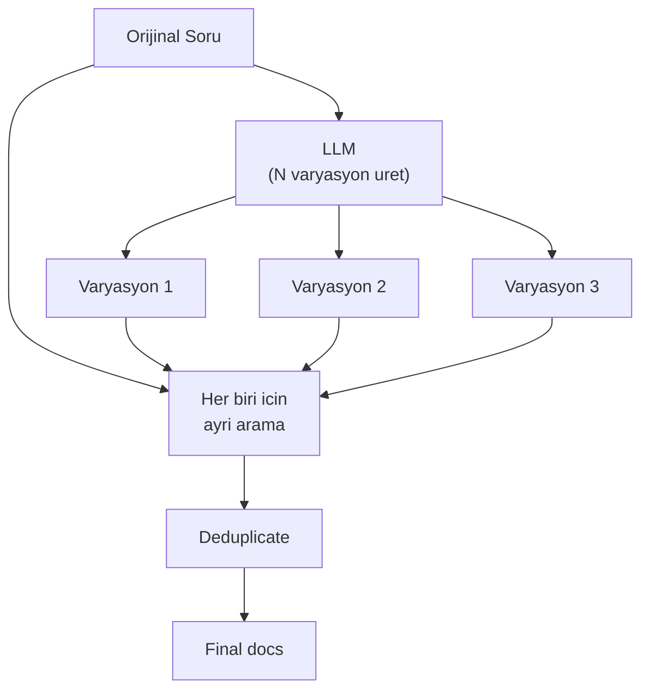

# Query Translation

Multi-query ve diger query transformation tekniklerini iceren modul. Kullanici sorularini farkli sekillerde ifade ederek retrieval basarisini arttirir.

## Kullanim

```python
from src.query_translation import generate_multi_queries, create_multi_query_retriever

# Alternatif soru uret
queries = generate_multi_queries("Sprint nedir?", llm, num_queries=3)
# ["Sprint nedir?", "Sprint'in tanimi nedir?", "What is a Sprint?", ...]

# Multi-query retriever olustur
retriever = create_multi_query_retriever(
    vectorstore=vectorstore,
    question="Sprint nedir?",
    llm=llm,
    num_queries=3,
)
```

## Nasil Calisir



## API Referansi

::: src.query_translation
