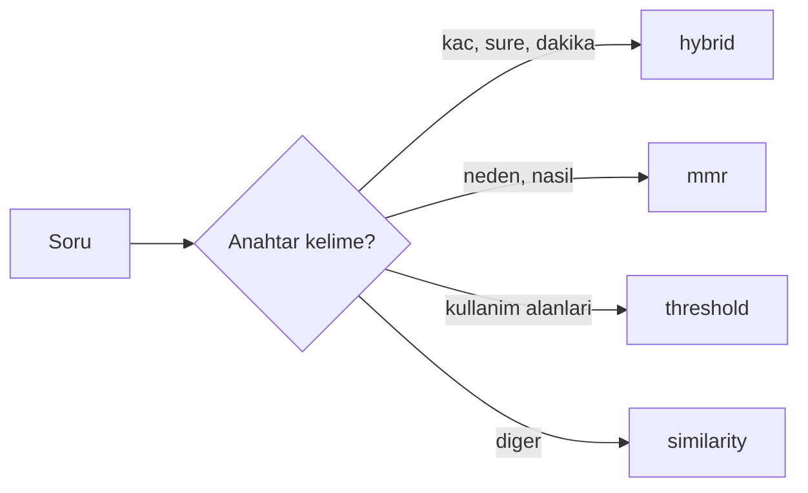

# Retriever

Gelismis arama modulu. Kullanici sorusuna en uygun dokuman parcalarini bulur. Auto strategy, hybrid search, dynamic k, multi-query ve reranking destekler.

## Kullanim

```python
from src.retriever import create_retriever, build_bm25_retriever

# BM25 index kur (1 kez)
bm25_retriever = build_bm25_retriever(docs)

# Retriever olustur (her sorguda)
retriever = create_retriever(
    vectorstore=vectorstore,
    question="Daily Scrum kac dakika surer?",
    bm25_retriever=bm25_retriever,
    strategy="auto",
    use_multi_query=False,
    use_rerank=False,
)
```

## Strateji Secimi



## API Referansi

::: src.retriever.build_bm25_retriever

::: src.retriever.calculate_dynamic_k

::: src.retriever.auto_select_strategy

::: src.retriever.create_hybrid_retriever

::: src.retriever.create_retriever
