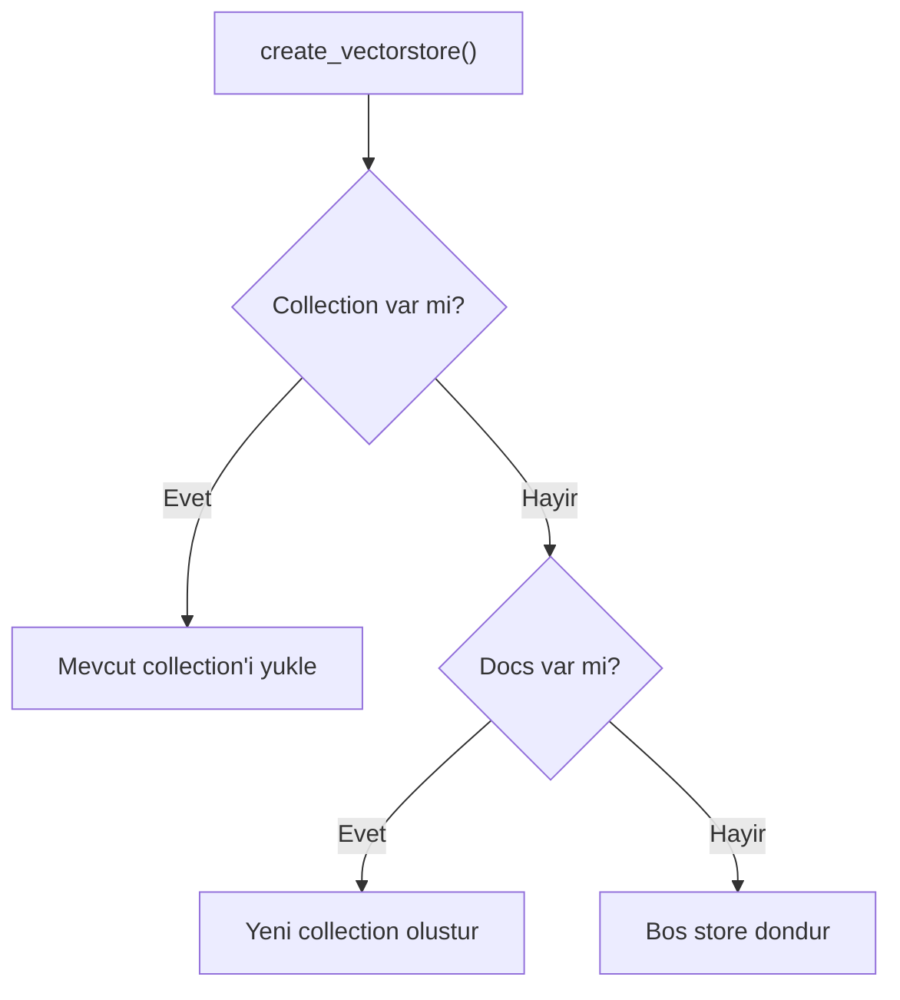

# Vectorstore

Vektor veritabani modulu. Metinleri embedding'lere cevirir ve Qdrant'a kaydeder. Incremental indexing (ekle/sil) destegi sunar.

## Kullanim

```python
from src.vectorstore import create_embeddings, create_vectorstore
from src.vectorstore import add_documents_to_collection, delete_from_collection

# Embedding modeli
embeddings = create_embeddings(device="cuda")

# Vectorstore olustur / yukle
vectorstore = create_vectorstore(docs, embeddings, url="http://localhost:6333")

# Incremental ekleme
add_documents_to_collection(vectorstore, new_chunks)

# Incremental silme
delete_from_collection(vectorstore, "/path/to/file.pdf")
```

## Qdrant Collection Mantigi



## API Referansi

::: src.vectorstore.create_embeddings

::: src.vectorstore.create_vectorstore

::: src.vectorstore.add_documents_to_collection

::: src.vectorstore.delete_from_collection
